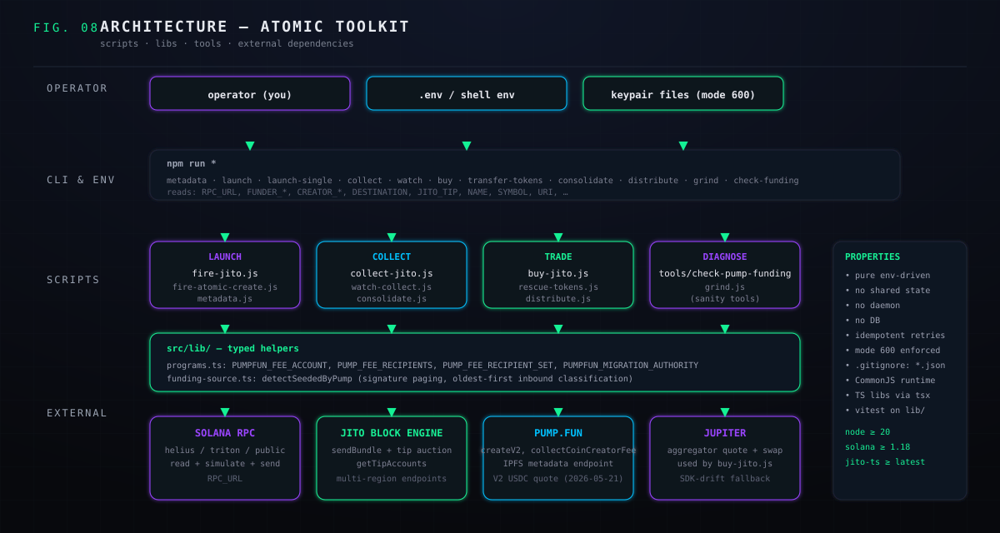
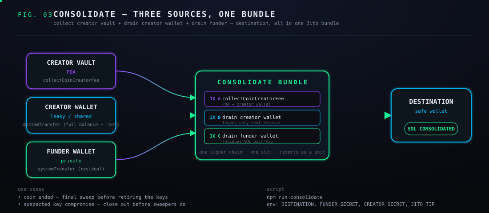
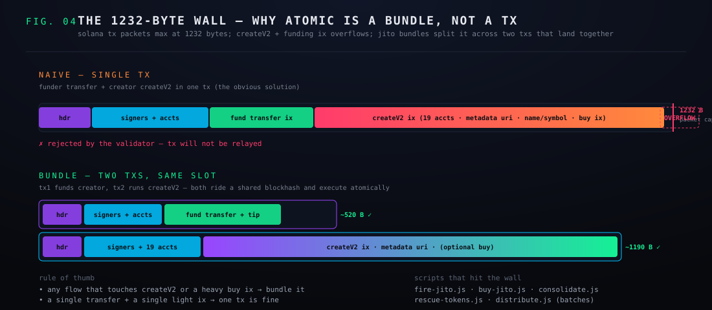
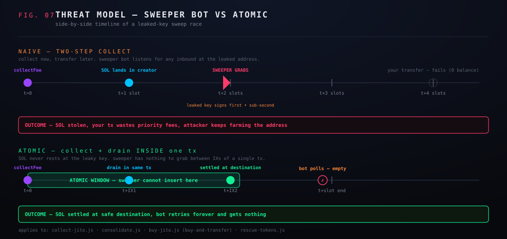
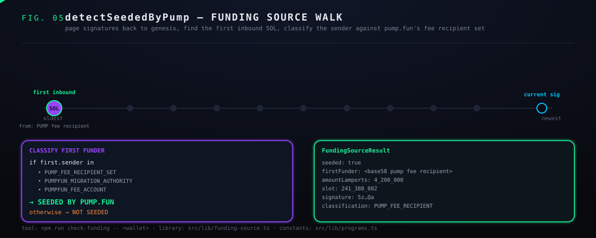

<!--
   █████╗ ████████╗ ██████╗ ███╗   ███╗██╗ ██████╗
  ██╔══██╗╚══██╔══╝██╔═══██╗████╗ ████║██║██╔════╝
  ███████║   ██║   ██║   ██║██╔████╔██║██║██║
  ██╔══██║   ██║   ██║   ██║██║╚██╔╝██║██║██║
  ██║  ██║   ██║   ╚██████╔╝██║ ╚═╝ ██║██║╚██████╗
  ╚═╝  ╚═╝   ╚═╝    ╚═════╝ ╚═╝     ╚═╝╚═╝ ╚═════╝
       all-or-nothing pump.fun launching & fee collection
-->

<p align="center">
  
</p>

```
   █████╗ ████████╗ ██████╗ ███╗   ███╗██╗ ██████╗
  ██╔══██╗╚══██╔══╝██╔═══██╗████╗ ████║██║██╔════╝
  ███████║   ██║   ██║   ██║██╔████╔██║██║██║
  ██╔══██║   ██║   ██║   ██║██║╚██╔╝██║██║██║
  ██║  ██║   ██║   ╚██████╔╝██║ ╚═╝ ██║██║╚██████╗
  ╚═╝  ╚═╝   ╚═╝    ╚═════╝ ╚═╝     ╚═╝╚═╝ ╚═════╝
       all-or-nothing pump.fun launching & fee collection
```

<p align="center">
  <a href="#license"></a>
  <a href="#setup"></a>
  
  
  
  
</p>

<p align="center"><i>Atomic create. Atomic collect. No window for a sweeper bot.</i></p>

---

## Table of contents

- [What this is](#pump-launch-toolkit)
- [At a glance](#at-a-glance)
- [System architecture](#system-architecture)
- [Layout](#layout)
- [Docs](#docs)
- [Setup](#setup)
- [Scripts](#scripts)
- [Typical launch flow](#typical-launch-flow)
- [Collecting + auto-collecting](#collecting--auto-collecting)
- [Consolidating creator vault, creator wallet, and funder](#consolidating-creator-vault-creator-wallet-and-funder)
- [The 1232-byte wall](#the-1232-byte-wall)
- [Sweeper-bot threat model](#sweeper-bot-threat-model)
- [Rewards distribution](#rewards-distribution)
- [Funding-source detection](#funding-source-detection)
- [Environment variables](#environment-variables)
- [Security notes](#security-notes)
- [Architecture: why Jito bundles](#architecture-why-jito-bundles)
- [Shared TS helpers (`src/lib/`)](#shared-ts-helpers-srclib)
- [Tests](#tests)
- [Glossary](#glossary)
- [Reference docs](#reference-docs)
- [Visual index](#visual-index)
- [Command cheat-sheet](#command-cheat-sheet)
- [License](#license)

## At a glance

|     |     |
| --- | --- |
| **Atomic launch** | funder pays rent + Jito tip in Tx1, creator signs `createV2` in Tx2 — both land or neither does |
| **Atomic collect** | `collectCoinCreatorFee` + drain to safe wallet in one tx, so a leaked creator key can't be swept |
| **MEV-aware** | every multi-step money flow runs inside a Jito bundle, so no searcher can interleave |
| **Tiny surface** | plain CommonJS scripts under [`src/`](src/), TS helpers under [`src/lib/`](src/lib/), one CLI tool under [`tools/`](tools/) |
| **Pure env-driven** | every script is configured with environment variables — copy [`.env.example`](.env.example) and go |

<p align="center">
  
</p>

## System architecture

A bird's-eye view of how the toolkit hangs together: operator → CLI/env → scripts → shared libs → external services.

<p align="center">
  
</p>

The system is intentionally **stateless** — no daemon, no database, no shared lock files. Every script is a single-shot process that reads env vars, talks to RPC + Jito, and exits. The only persistent state is on-chain (your wallets, your coin, your destination).

# pump-launch-toolkit

Atomic scripts for launching, collecting fees from, and trading pump.fun coins. Built around **Jito bundles** for atomicity across multiple txs — useful when:

- You need the create tx's fee payer to differ from the wallet supplying the SOL (separate funder vs creator)
- The creator wallet has a public/shared private key (e.g. multi-sig setup, or you accept other signers exist) and you want every fee collection to atomically move the SOL to a safe wallet on the same tx
- You want to win the race against MEV/sweeper bots watching specific addresses

> ⚠️ **Secrets handling.** All scripts read keypairs from environment variables (base58) or local JSON files. **Never commit either form.** `.gitignore` excludes `*.json` by default (with allowlist exceptions for `package.json`, `tsconfig.json`, and lockfiles).

## Layout

```
.
├── src/                       Runnable scripts (CommonJS, run via `node src/<name>.js`)
│   ├── fire-jito.js, collect-jito.js, …
│   └── lib/                   Shared TS helpers
│       ├── funding-source.ts  detectSeededByPump implementation
│       ├── programs.ts        Pump.fun program IDs + fee recipients
│       └── funding-source.test.ts
├── tools/
│   └── check-pump-funding.ts  CLI wrapper around detectSeededByPump (run via tsx)
├── .env.example               Copy to `.env` and fill in
├── package.json               npm scripts cover every runnable file
└── tsconfig.json              Type-checks src/lib/ + tools/
```

## Docs

The pages under [`docs/`](docs/) go deeper than this README:

- [**docs/setup.md**](docs/setup.md) — wallets, funding, RPC choice, Jito tip refresh, troubleshooting.
- [**docs/architecture.md**](docs/architecture.md) — funder vs creator, the 1232-byte tx-size constraint, bundle layouts, sweeper-bot threat model.
- [**docs/recipes.md**](docs/recipes.md) — end-to-end flows: launch + auto-collect, rescue from leaked wallet, USDC distribution, etc.
- [**docs/scripts/**](docs/scripts/) — one reference page per runnable file: env vars, tx layout, signing flow, failure modes.

The [`docs/README.md`](docs/README.md) is the index.

## Setup

```bash
npm install
cp .env.example .env
# fill in .env with your keys and target addresses
```

## Scripts

| Script | npm | Purpose |
|---|---|---|
| `src/metadata.js` | `npm run metadata` | Upload token metadata to pump.fun's IPFS endpoint. Returns a URI to pass to launchers. |
| `src/fire-jito.js` | `npm run launch` | **Launch via Jito bundle.** Two-tx bundle: funder pays rent + tip in Tx1; creator pays own fee in Tx2 (createV2). Solscan "from" on the create = creator. |
| `src/fire-atomic-create.js` | `npm run launch-single` | Single-tx create-only launch. No Jito needed. Fee payer = funder; on-chain creator = creator wallet (signed but not fee payer). |
| `src/collect-jito.js` | `npm run collect` | Atomic creator-fee collection. Single tx: pump's `collectCoinCreatorFee` + drain to `DESTINATION`. No window for a competing collector with the same key. |
| `src/watch-collect.js` | `npm run watch` | Long-running poller that runs `collect-jito.js` whenever the vault accumulates ≥ threshold. |
| `src/consolidate.js` | `npm run consolidate` | One-shot: collect creator vault + drain creator wallet + drain funder, all to `DESTINATION`, in one Jito bundle tx. |
| `src/buy-jito.js` | `npm run buy` | Buy a token via Jupiter aggregator using a Jito bundle. Useful when pump-sdk's buy ix is out of sync with the live program. |
| `src/rescue-tokens.js` | `npm run transfer-tokens` | Atomic SPL/Token-2022 transfer via Jito bundle. Bot can't insert. |
| `src/distribute.js` | `npm run distribute` | Sqrt-weighted USDC rewards distribution to holders. Includes `EMERGENCY` mode for sweeping to a single address. |
| `src/grind.js` | `npm run grind` | JS-based vanity address grinder (slow). `solana-keygen grind` is far faster. |
| `tools/check-pump-funding.ts` | `npm run check-funding -- <wallet>` | Check whether a wallet was seeded by pump.fun (first inbound SOL from a fee recipient or migration authority). |

## Typical launch flow

```bash
# 1. Upload metadata (gets a URI)
NAME="MyCoin" SYMBOL="MEME" IMAGE_PATH=./logo.png \
  npm run metadata
# -> https://ipfs.io/ipfs/<CID>

# 2. Launch via Jito bundle (creator = fee payer of create tx)
URI="https://ipfs.io/ipfs/<CID>" \
NAME=MyCoin SYMBOL=MEME \
FUNDER_SECRET=<base58> \
CREATOR_SECRET=<base58> \
JITO_TIP=0.005 \
  npm run launch
```

## Collecting + auto-collecting

<p align="center">
  
</p>

```bash
# Manual one-shot
DESTINATION=<your-safe-wallet> \
FUNDER_SECRET=<base58> \
CREATOR_SECRET=<base58> \
  npm run collect

# Long-running watcher (polls every 30s)
DESTINATION=<your-safe-wallet> \
FUNDER_SECRET=<base58> \
CREATOR_SECRET=<base58> \
CREATOR_PUBKEY=<base58-pubkey> \
MIN_COLLECT_SOL=0.05 \
  npm run watch
```

## Consolidating creator vault, creator wallet, and funder

When a coin is winding down — or a creator key is suspected compromised — `consolidate.js` does a **single Jito bundle** that drains all three balances (vault PDA, creator wallet, funder wallet) into the same `DESTINATION`. If any instruction fails, the whole bundle reverts and nothing settles. This is the cleanest way to close out a coin without giving sweeper bots a window to grab residuals.

<p align="center">
  
</p>

```bash
DESTINATION=<your-safe-wallet> \
FUNDER_SECRET=<base58> \
CREATOR_SECRET=<base58> \
JITO_TIP=0.01 \
  npm run consolidate
```

## The 1232-byte wall

Solana transactions cap at **1232 bytes per packet**. A pump.fun `createV2` already runs ~1190 B by itself once you include the 19 accounts, the metadata URI, name, symbol, and any bundled buy. There is **no room** to also include a system transfer that funds the creator with rent SOL — so the obvious "one tx does it all" design fails outside the lab.

Jito bundles solve this by splitting the work across **two transactions that share a blockhash and land in the same slot**, all-or-nothing. No MEV searcher can interleave between them.

<p align="center">
  
</p>

## Sweeper-bot threat model

Sweeper bots watch known public/shared keys and pull funds within ~1 slot of any inbound transfer. The naive collect → wait → transfer flow loses every race. The atomic flow makes the race irrelevant — the bot polls an empty wallet forever, because the SOL never rests there.

<p align="center">
  
</p>

| Threat | Naive flow | Atomic flow |
|---|---|---|
| Leaked creator key | sweeper drains creator wallet between collect and transfer | SOL never rests in the creator wallet |
| Buy-and-hold from a shared key | tokens land in a watched ATA, swept in seconds | bundle the buy with a transfer to a private destination |
| Token-2022 sweep | sweeper moves tokens out of the buyer ATA | rescue-tokens.js bundles the SPL transfer atomically |
| Front-run on launch | bot inserts between funding and create | shared-blockhash bundle leaves no slot to insert into |

## Rewards distribution

`distribute.js` pays USDC rewards back to holders proportional to **`sqrt(balance)`** — a square-root curve dampens whale dominance without disenfranchising small holders. Holders below `MIN_BPS` are skipped; an `EMERGENCY` mode collapses the pool to a single address.

<p align="center">
  
</p>

```bash
MINT=<your-mint> \
REWARD_PERCENT=50 \
MIN_BPS=10 \
DESTINATION=<funded-payer> \
FUNDER_SECRET=<base58> \
  npm run distribute
```

## Funding-source detection

`detectSeededByPump` (in [`src/lib/funding-source.ts`](src/lib/funding-source.ts)) walks a wallet's signatures back to its oldest tx, finds the first inbound SOL transfer, and checks the sender against the canonical pump.fun fee-recipient set + migration authority. Useful for forensics, leak-attribution, and sanity-checking a fresh creator wallet.

<p align="center">
  
</p>

```bash
# CLI wrapper
npm run check-funding -- <wallet-pubkey>
# -> verdict: SEEDED BY PUMP.FUN  /  NOT SEEDED
# -> firstFunder, amount, slot, signature
```

## Environment variables

All variables can be supplied via shell env or a `.env` file at the repo root. See [`.env.example`](.env.example) for a copy-paste template.

| Var | Used by | Purpose |
|---|---|---|
| `RPC_URL` | all | Solana RPC endpoint. Public mainnet works; Helius/Triton recommended for production. |
| `FUNDER_SECRET` | most | Base58 secret key of the wallet supplying SOL for rent + tips. |
| `CREATOR_SECRET` | launch / collect | Base58 secret key of the on-chain creator wallet (the address that appears as creator on pump.fun). |
| `FUNDER_KEYPAIR` / `CREATOR_KEYPAIR` | most | Alternative to the `*_SECRET` vars: filesystem path to a Solana CLI keypair JSON. |
| `DESTINATION` | collect / consolidate / distribute | Safe wallet that drained SOL/tokens settle into. |
| `CREATOR_PUBKEY` | `watch-collect.js` | Public key to poll for accumulated creator-fee vault balance. |
| `NAME`, `SYMBOL`, `URI` | metadata / launch | Token name, ticker, and metadata URI. |
| `IMAGE_PATH` | `metadata.js` | Local image to upload to pump.fun IPFS. |
| `DEV_BUY_SOL` | launch | Optional dev-buy size atomically bundled with the create. `0` to skip. |
| `JITO_TIP` | Jito-bundle scripts | Tip in SOL paid to the Jito block engine. 0.005 is a sane start; raise to 0.01–0.02 in busy markets. |
| `PRIORITY` | most | Compute-unit price in micro-lamports. |
| `TARGET_MINT` | `buy-jito.js` | Mint address of the token to buy. |
| `BUY_SOL` | `buy-jito.js` | SOL amount to spend per buy. |
| `SLIPPAGE_BPS` | `buy-jito.js` | Slippage tolerance in basis points (500 = 5%). |
| `MIN_COLLECT_SOL` | `watch-collect.js` | Vault threshold (SOL) before the poller fires a collect bundle. |
| `MINT`, `REWARD_PERCENT`, `MIN_BPS` | `distribute.js` | Token to distribute USDC rewards for, percentage of collected fees to share, minimum holder share in bps. |

## Security notes

- **Sweeper bots watch public/leaked keys.** SOL or tokens that *rest* in such a wallet for more than a few seconds will be drained. The atomic patterns in this toolkit work around this by ensuring funds never settle there.
- **Token-2022 sweepers exist.** If you buy a token *to* a public/shared wallet, expect the tokens to be moved out by other key-holders within ~3 seconds. Use `rescue-tokens.js` patterns to atomically buy-and-transfer if you need plausible deniability about the buyer wallet.
- **Jito tip auctions.** 0.001 SOL is the floor but rarely lands in busy times. Start at 0.005, bump to 0.01–0.02 if bundles return `Invalid` from Jito.
- **Jito tip account rotation.** The hardcoded list may drift. Fetch `getTipAccounts` from the Jito Block Engine RPC if you hit `"Bundles must write lock at least one tip account"` errors.
- **pump-sdk version drift.** The buy instruction may add required accounts that older SDK versions don't include (e.g. `BuybackFeeRecipient`). When this happens, route buys through Jupiter (`buy-jito.js`) instead.

## Architecture: why Jito bundles

A pump.fun create instruction has many accounts and is near the 1232-byte tx size limit. To make the create tx come **from** the creator wallet (so on-chain attribution matches), you'd need to also fund the creator with rent SOL atomically — but that pushes the tx over size.

Jito bundles solve this: two separate txs that share a blockhash and execute atomically (all-or-nothing) on the block engine. No bot can insert between them. This is the basis of `fire-jito.js`, `collect-jito.js`, `consolidate.js`, `buy-jito.js`, and `rescue-tokens.js`.

## Shared TS helpers ([`src/lib/`](src/lib/))

The `src/lib/` directory holds a small set of TypeScript helpers shared between [`tools/`](tools/) and (in future) any TS scripts:

| Module | Exports | Purpose |
|---|---|---|
| [`programs.ts`](src/lib/programs.ts) | `PUMPFUN_FEE_ACCOUNT`, `PUMP_FEE_RECIPIENTS`, `PUMP_FEE_RECIPIENT_SET`, `PUMPFUN_MIGRATION_AUTHORITY` | Canonical pump.fun fee/migration account IDs. |
| [`funding-source.ts`](src/lib/funding-source.ts) | `detectSeededByPump`, `FundingSourceResult`, `DetectSeededByPumpOptions` | Walks a wallet's signatures to its oldest tx, finds the first inbound SOL transfer, and returns whether the sender was a known pump.fun address. |

The library is consumed by [`tools/check-pump-funding.ts`](tools/check-pump-funding.ts).

## Tests

Vitest covers `src/lib/`:

```bash
npm test               # one-shot
npm run test:watch     # watch mode
npm run typecheck      # tsc --noEmit
```

[`tools/check-pump-funding.ts`](tools/check-pump-funding.ts) can be smoke-tested against a known pump-seeded wallet on mainnet — the verdict should be `SEEDED BY PUMP.FUN` with the first funder being one of the pump fee recipients.

## Glossary

- **Funder** — the wallet that pays rent + Jito tips. Holds the bulk of SOL; signs Tx1 of a launch bundle. Generally a fresh, private key.
- **Creator** — the wallet that appears as the on-chain creator on pump.fun. Signs the `createV2` instruction. May have a public or shared private key (which is the whole reason for the atomic collect pattern).
- **Creator vault** — the PDA where pump.fun accumulates creator fees for a coin. Drained via `collectCoinCreatorFee`.
- **Destination** — the safe wallet that collected SOL/tokens are atomically routed to in the same tx, so no sweeper bot has a window to grab them.
- **Jito bundle** — an ordered group of txs submitted to the Jito Block Engine that execute atomically (all-or-nothing) and that no MEV searcher can interleave between. The basis of every `*-jito.js` script.
- **Jito tip** — SOL paid to a Jito tip account in one of the bundle txs. Acts as an auction bid for inclusion. Floor is 0.001 SOL; in busy windows you need 0.005–0.02 SOL to land.
- **Seeded by pump.fun** — a wallet whose first inbound SOL transfer originated from a pump.fun fee recipient or the migration authority. Detected by `detectSeededByPump` / [`tools/check-pump-funding.ts`](tools/check-pump-funding.ts).

## Reference docs

- [**pump.fun V2 USDC Rollout reference**](./docs/v2-usdc-rollout/README.md) — full engineering reference for the 2026-05-21 V2 USDC quote-mint upgrade: instruction & event discriminators, byte layouts, parsing patterns, migration recipes, per-repo audit, and standalone executor prompts under [`prompts/v2-usdc-rollout/`](./prompts/v2-usdc-rollout/).

## Visual index

All visuals live under [`docs/assets/`](docs/assets/) as standalone animated SVGs (no JS, no external assets). They render inline on GitHub and can be embedded into other docs, slide decks, or talks.

| # | Visual | Section | Shows |
|---|---|---|---|
| 00 | [](docs/assets/atomic-logo.svg) | top-of-readme | Hero mark — orbiting electrons over a Solana-themed nucleus, status pill, feature strip. |
| 01 | [](docs/assets/jito-bundle-flow.svg) | [At a glance](#at-a-glance) | Funder + Creator → Jito bundle → block engine → on-chain. Byte sizes, signer counts, slot timeline. |
| 02 | [](docs/assets/atomic-collect.svg) | [Collecting](#collecting--auto-collecting) | One-tx collect + drain. Sweeper bot retries shown failing tick-by-tick. |
| 03 | [](docs/assets/consolidate-flow.svg) | [Consolidate](#consolidating-creator-vault-creator-wallet-and-funder) | Three sources (vault, creator, funder) → one bundle → destination. |
| 04 | [](docs/assets/tx-size-constraint.svg) | [1232-byte wall](#the-1232-byte-wall) | Why a single tx overflows the packet cap, and how a two-tx bundle fits. |
| 05 | [](docs/assets/funding-source-walk.svg) | [Funding-source detection](#funding-source-detection) | `detectSeededByPump` walking signatures back to first inbound SOL. |
| 06 | [](docs/assets/distribute-rewards.svg) | [Rewards](#rewards-distribution) | Sqrt-weighted USDC distribution, MIN_BPS filter, EMERGENCY mode. |
| 07 | [](docs/assets/threat-model.svg) | [Threat model](#sweeper-bot-threat-model) | Naive vs atomic timeline of a leaked-key sweep race. |
| 08 | [](docs/assets/architecture.svg) | [System architecture](#system-architecture) | Operator → CLI/env → scripts → libs → external (RPC, Jito, pump.fun, Jupiter). |

## Command cheat-sheet

| Goal | Command |
|---|---|
| Upload token metadata | `npm run metadata` |
| Atomic launch (Jito) | `npm run launch` |
| Single-tx launch (no Jito) | `npm run launch-single` |
| One-shot creator-fee collect | `npm run collect` |
| Long-running collect watcher | `npm run watch` |
| Buy via Jupiter inside a bundle | `npm run buy` |
| Atomic SPL/Token-2022 rescue | `npm run transfer-tokens` |
| Drain creator + funder to destination | `npm run consolidate` |
| Sqrt-weighted USDC distribution | `npm run distribute` |
| Check whether a wallet was seeded by pump.fun | `npm run check-funding -- <wallet>` |
| Vanity grinder (slow JS) | `npm run grind` |

See [`Scripts`](#scripts) above for the full description of each command, and [`docs/scripts/`](docs/scripts/) for per-script reference pages (env vars, tx layout, signing flow, failure modes).

## License

MIT
